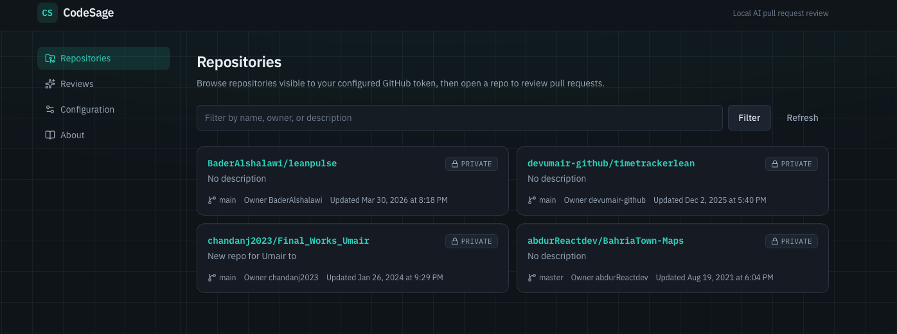
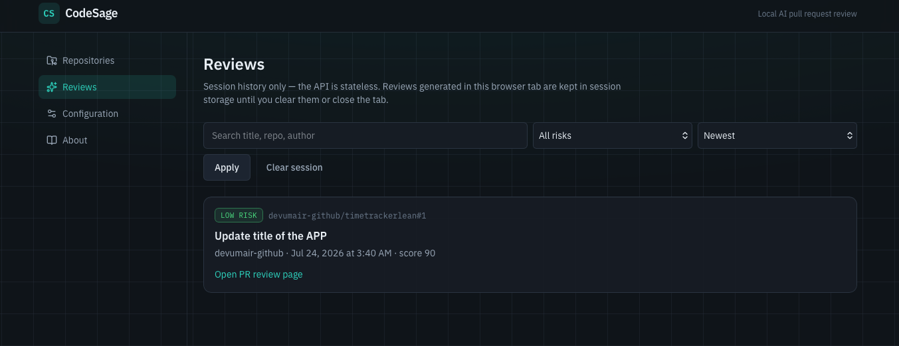
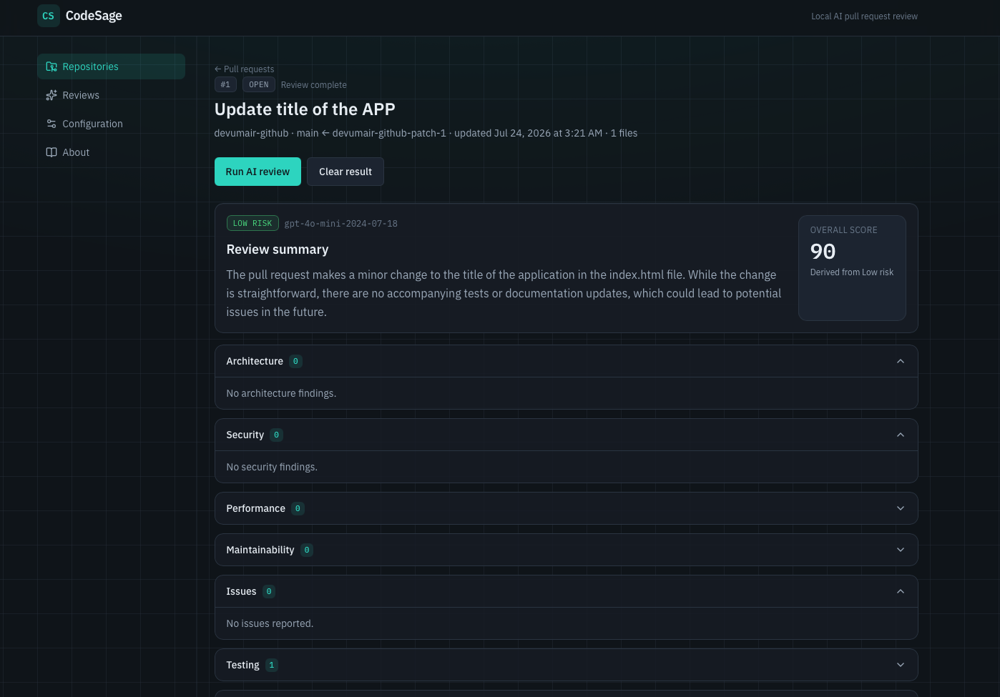

# CodeSage

Local-first, **stateless** AI pull request review assistant.

Configure a GitHub Personal Access Token and an OpenAI API key, run locally, and review PRs through a simple UI. No accounts, no OAuth, no database, no cloud lock-in.

**Repo:** [github.com/dev-umairasghar/codesage](https://github.com/dev-umairasghar/codesage)

## Screenshots







## Prerequisites

- [.NET 9 SDK](https://dotnet.microsoft.com/download/dotnet/9.0) (runtime/SDK 9.x)
- [Node.js 20+](https://nodejs.org/)
- GitHub PAT with access to the repos you want to review
- OpenAI API key

> Never commit secrets. Do **not** put keys in `appsettings.json`. Use user-secrets or environment variables.

## Quick start

```bash
git clone https://github.com/dev-umairasghar/codesage.git
cd codesage
```

### 1. API (`http://localhost:5080`)

```bash
dotnet restore
dotnet build

cd src/CodeSage.Api
dotnet user-secrets set "GitHub:PersonalAccessToken" "ghp_your_token"
dotnet user-secrets set "OpenAI:ApiKey" "sk-your_key"
cd ../..

dotnet run --project src/CodeSage.Api
```

Swagger (Development): `http://localhost:5080/swagger`

### 2. Web UI (`http://localhost:5173`)

```bash
cd web
npm install
npm run dev
```

Vite proxies `/api` to the API. Open the UI and follow:

**Repositories → Pull request → Run AI review**

## Configuration

| Approach | When to use |
|----------|-------------|
| **User secrets** (recommended locally) | Day-to-day development |
| Environment variables (`GitHub__PersonalAccessToken`, `OpenAI__ApiKey`) | CI / containers |
| `appsettings.*.json` | Non-secret defaults only |

Details: [docs/Configuration.md](docs/Configuration.md)

## API overview

| Method | Path | Purpose |
|--------|------|---------|
| `GET` | `/api/v1/health` | Liveness |
| `GET` | `/api/v1/system/status` | Diagnostics (no secrets) |
| `GET` | `/api/v1/configuration` | Public config summary |
| `GET` | `/api/v1/repositories` | List repos |
| `GET` | `/api/v1/repositories/{owner}/{name}/pull-requests` | List PRs |
| `POST` | `/api/v1/reviews` | Stateless AI review |

Full docs: [docs/api.md](docs/api.md) · OpenAPI: [docs/openapi-v1.json](docs/openapi-v1.json) · Web: [web/README.md](web/README.md)

## Project layout

```
src/     ASP.NET Core API (Clean Architecture)
web/     React + Vite + TypeScript UI
tests/   .NET unit + integration tests
docs/    API and configuration docs
```

## Tests

```bash
dotnet test
cd web && npm test
```

## License

MIT — see [LICENSE](LICENSE).

## Design notes

- Frontend talks only to the CodeSage API (never GitHub/OpenAI directly)
- Reviews are stateless — session history in the UI is browser-only
- Errors use RFC 7807 ProblemDetails with `errorCode` + `traceId`
